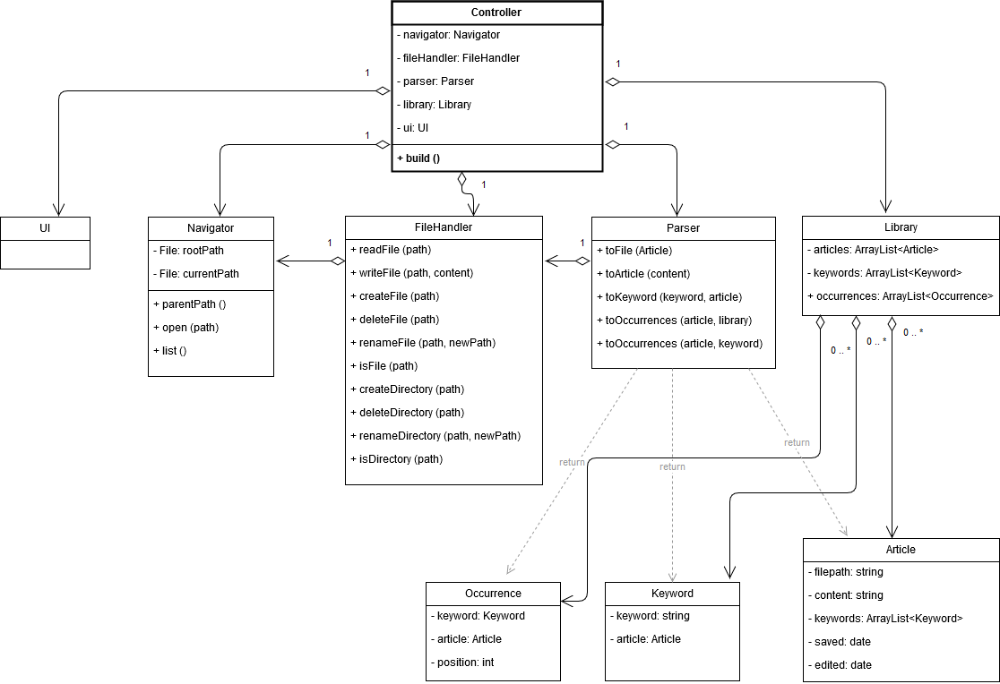
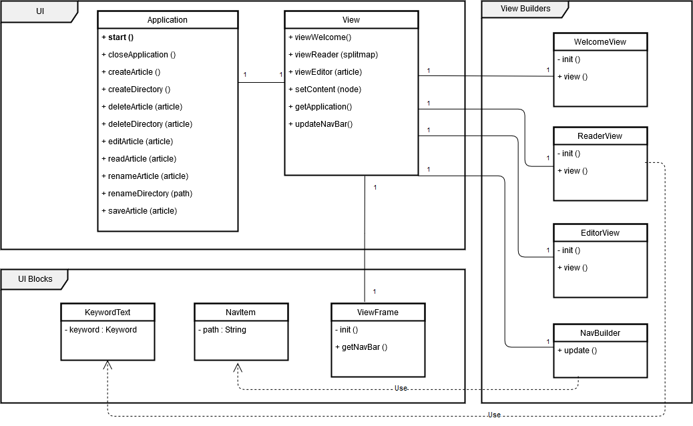

### Aiheen kuvaus
**Aihe**: Glorifioitu muistiinpano-ohjelma, eli lievästi wikihenkinen työkalu joka automaattisesti luo linkkejä tekstiin tunnettujen aiheiden perusteella. Tuloksena on kokoelma ristiin linkattuja tekstitiedostoja, joiden avainsanat värittyvät ohjelman näkymässä ja joita voi lisätä ja muokata halunsa mukaan.

**Esimerkki**: Käyttäjä luo tekstin nimeltä Porkkana, sekä toisen tekstin nimeltä Kasvimaa. Jos Kasvimaa-teksti sisältää sanan "porkkana", kuten esimerkiksi "puutarhassa kasvaa porkkanaa ja tomaattia", sana "porkkana" esitetään uniikilla värillä ja sitä klikkaamalla siirrytään näkymässä Porkkana-nimiseen tekstiin.

**Käyttäjät**: Tekstin muokkaaja

**Toiminnot**:
* uuden kansion luominen
* kansion uudelleen nimeäminen
* kansion poistaminen
* uuden artikkelin (tekstitiedoston) luominen
* artikkelin uudelleen nimeäminen
* artikkelin poistaminen
* artikkelin tekstin muokkaaminen
* artikkelien välillä liikkuminen linkkejä klikkaamalla

### Rakenteen kuvaus
[sekvenssikaavio puuttuu, koska niitä käsittelevä kurssi on käymättä]

Luokat on rakennettu löyhästi MVC-mallia mukaillen. Application-luokka vastaa MVC:n controller-luokkaa, eli luokka on vastuussa ohjelmalogiikasta ja näkymän hallinnasta. Sen tärkein riippuvuus on luokka View, jonka vastuulla on controllerin ohjeiden mukainen näkymän piirtäminen.

View hyödyntää "view builder" -luokkia, jotka sijaitsevat paketissa *ui.view*. Kullakin luokalla on tietty näkymän osa-alueensa, kuten sivupalkki tai editointinäkymä. View builder -luokkien lisäksi on muutamia "view block" -luokkia (paketissa *ui.elements*), jotka laajentavat JavaFX:n palikoiden perustoiminnallisuuksia. Yksi esimerkki on KeywordText, joka muutoin käyttäytyy kuin JavaFX:n oma Text-luokka, mutta sisältää viitteen Keyword-luokkaan.

MVC-periaatteita vastaavat dataluokat sijaitsevat *data*-paketissa. Artikkelit (Article) sisältävät teksitiedostoihin liittyvät tiedot, kuten tekstitiedoston nimen ja sisällön, ja avainsanat (Keyword) ovat ristiviitteitä näiden välillä. Kirjastoluokka (Library) ylläpitää luetteloa artikkeleista ja niihin liittyvistä avainsanoista. Library-luokka on ns. singleton-luokka, eli koko ohjelman laajuudella käytetään vain yhtä kirjastoa, jonka instanssia voi kutsua tarvitessa.

Ohjelma hyödyntää myös muita singleton-luokkia, joilla kullakin on oma roolinsa apuluokkana. Nämä sijaitsevat *core*-paketissa ja vastaavat pieniä utility-kirjastoja. FileHandler-luokka käsittelee kaikki tiedosto-operaatiot, ja Parser-luokkaa hyödynnetään tiedon lukemiseen ja kirjoittamiseen dataluokkien ja tiedostojen välillä. Näiden rinnalla toimii Navigator-luokka, jonka avulla ohjelma voi navigoida turvallisesti kansiorakenteessa, ja joka myös mm. luettelee kansioiden sisällöt. Navigator-luokan tärkein tehtävä on standardoida tiedostoviitteet (path) niin, ettei tietoturva-aukkoja esiinny.

Lisäksi on geneerinen Utils-luokka, joka sisältää apumetodeja tiedostonimien formatointiin.

*MVC-mallia mukaileva kaavio ohjelmalogiikasta:*

*Näkymäluokkien riippuvuussuhteet:*

