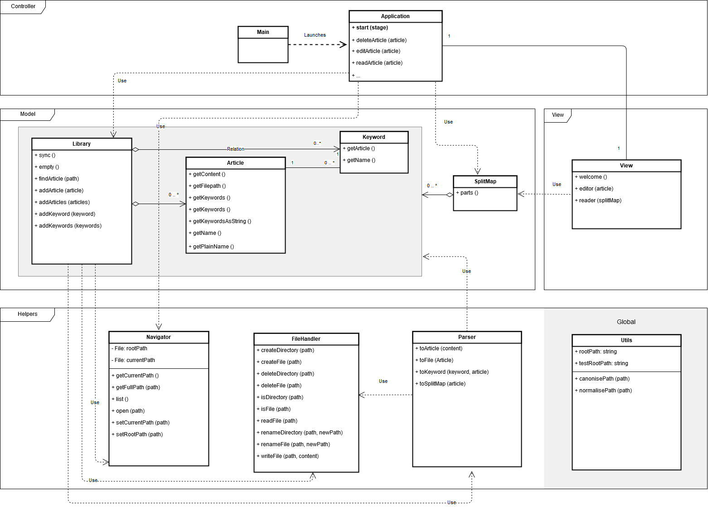

**Aihe**: Glorifioitu muistiinpano-ohjelma, eli lievästi wikihenkinen työkalu joka automaattisesti luo linkkejä tekstiin tunnettujen aiheiden perusteella. Tuloksena on kokoelma ristiin linkattuja tekstitiedostoja (joko txt tai md riippuen paljonko formatointiin jää aikaa), joiden avainsanat värittyvät ohjelman näkymässä ja joita voi lisätä ja muokata halunsa mukaan. Syntyvien ristiviitteiden avulla toiminnallisuuksia voi ajan myötä luoda lisää. Myös esim. hakutoiminto voi olla mahdollinen.

Koska suomen kielen sanat taipuvat niin monella tapaa, tekstit todennäköisesti tarvitsevat erillisen metakentän, jossa käyttäjä voi itse määrittää sanan vaihtoehtoiset kirjoitusmuodot.

**Esimerkki**: Käyttäjä luo tekstin nimeltä Porkkana, sekä toisen tekstin nimeltä Kasvimaa. Jos Kasvimaa-teksti sisältää sanan "porkkana", kuten esimerkiksi "puutarhassa kasvaa porkkanaa ja tomaattia", sana "porkkana" esitetään uniikilla värillä ja sitä klikkaamalla siirrytään näkymässä Porkkana-nimiseen tekstiin.

**Käyttäjät**: Tekstin muokkaaja

**Toiminnot**:
* uuden kansion luominen
* kansion uudelleen nimeäminen
* kansion poistaminen
* uuden artikkelin (tekstitiedoston) luominen
* artikkelin uudelleen nimeäminen
* artikkelin poistaminen
* artikkelin tekstin muokkaaminen
* artikkelien välillä liikkuminen linkkejä klikkaamalla

